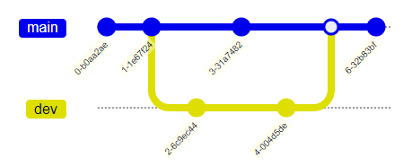

# Git - Collaboration

Teamwork with Git

---

## Remotes

- Project versions hosted on the Internet or network somewhere
  - Example: [GitHub](https://github.com)
- Access: read-only or read-write
- Collaboration: by *pulling and pushing data to and from* them
- Credentials
  - Store credentials with [credential helpers](https://git-scm.com/docs/gitcredentials)
  - Check configuration: `git config --global credential.helper`
  - Example: [GitHub on Windows](https://help.github.com/en/github/using-git/caching-your-github-password-in-git)

---

## Remote Commands Overview

| Git Command                                         | Description                                        |
| --------------------------------------------------- | -------------------------------------------------- |
| [`remote`](https://git-scm.com/docs/git-remote)     | Maintain remotes                                   |
| [`clone`](https://git-scm.com/docs/git-clone)       | Clone a repository into a new directory            |
| [`fetch`](https://git-scm.com/docs/git-fetch)       | Fetch branches and/or tags from other repositories |
| [`pull`](https://git-scm.com/docs/git-pull)         | Fetch from and integrate with another repository   |
| [`push`](https://git-scm.com/docs/git-push)         | Update remote branches and/or tags                 |
| [`checkout`](https://git-scm.com/docs/git-checkout) | Restore working tree files                         |

---

## `git remote` <small>([ref](https://git-scm.com/docs/git-remote))</small>

```bash
  # List remotes:
  git remote -v 

  # Add remote: 
  git remote add <name> <url>

  # Remove remote: 
  git remote remove <name>

  # Get URL of remote:
  git remote get-url <name>
```

---

## `git fetch` <small>([ref](https://git-scm.com/docs/git-fetch))</small>

- Gets latest meta-data from remote repository.
  - **Does not do any file transfer!**

## `git pull` <small>([ref](https://git-scm.com/docs/git-pull))</small>

- Fetches latest meta-data AND integrates changes in local repository.

---

## Branching

- Diverge from the main line of development and<br> continue to do work without messing with that main line.
- Branching operations are nearly instantaneous.
- Switching between branches is generally fast.
- [**Commit (and branch) early, branch often!**](https://coderwall.com/p/wxowig/git-is-cheap)

---

## Branching Commands Overview

| Git Command                                         | Description                                |
| --------------------------------------------------- | ------------------------------------------ |
| [`branch`](https://git-scm.com/docs/git-branch)     | List, create, or delete branches           |
| [`checkout`](https://git-scm.com/docs/git-checkout) | Switch branches                            |
| [`merge`](https://git-scm.com/docs/git-merge)       | Join development histories together        |
| [`rebase`](https://git-scm.com/docs/git-rebase)     | Reapply commits on top of another base tip |

---

## Branching - Workflow

- Create a branch for each *feature*
- Create a branch for each *bug fix*
- Keep the *main* branch clean by not making it a "*Work in Progress*"

---

## Branching - GitFlow

Atlassian.png)

<small>[Image Source: (c) Atlassian](https://www.atlassian.com/git/tutorials/comparing-workflows/gitflow-workflow)</small>

---

## Merging

[Learn Git Branching](https://learngitbranching.js.org/)

```mermaid-gitGraph
       commit
       commit
       branch dev
       checkout dev
       commit
       checkout main
       commit
       checkout dev
       commit
       checkout main
       merge dev
       commit
```



- **Advantage**: It’s a *non-destructive* operation (existing branches are not changed).

---

## Rebase

- Another way to "move" your branch back to `main` (or any other branch) is `rebase`:
  - Taking one branch and
  - adding it to the tip of another,
  - where the tip is simply the last commit in the branch.
- **Advantage**: Cleaner project history
- **Disadvantages**:  
  - Rewriting project history (traceability problem)
  - More merge conflicts, destructive operation (safety problem)

### Workflow

```mermaid-gitGraph_rebase_not_working_atm
branch bugfix
commit
rebase main
commit
rebase main
checkout main
merge bugfix
```

---

## Merge Conflicts

- If Git isn't able to merge cleanly -> **CONFLICT**
  - Merge process is paused
  - Use `git status` to see unmerged files
  - Git adds standard conflict-resolution markers (see below)
  - Tip: Use merge tool or IDE to resolve (vscode recommended)

```text
<<<<<<< HEAD:readme.md
Merge conflicts are best to be solved in the command line.
=======
Solving merge conflicts on the CLI is pretty hard
if you are not confident with `vi` or `vim`. 
Better use an editor like `vscode`. Try it out right now!
>>>>>>> iss23:readme.md
```

---

## Exercises, Further Readings

- Exercises (rstropek)
  - [Lab: Building a Website with GitHub](https://github.com/rstropek/git-fundamentals/blob/master/content/labs/0040-remotes.md)
  - [Demo: *Merge Conflict Resolution*](https://github.com/rstropek/git-fundamentals/blob/master/content/labs/9010-merge-conflict.md)
  - [Lab: *Building a Simple Game with Branching*](https://github.com/rstropek/git-fundamentals/blob/master/content/labs/0050-branching.md)
- Further readings:
  - [*Working with Remotes* in Git book](https://git-scm.com/book/en/v2/Git-Basics-Working-with-Remotes)
  - [*Basic Branching and Merging* in Git book](https://git-scm.com/book/en/v2/Git-Branching-Basic-Branching-and-Merging)
  - [Understanding the GitHub flow](https://guides.github.com/introduction/flow/)
